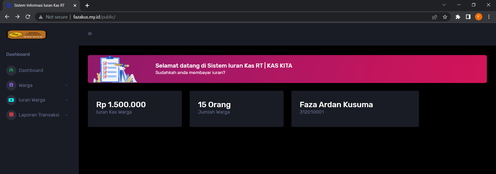
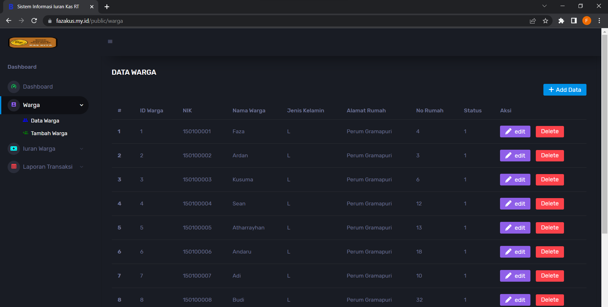
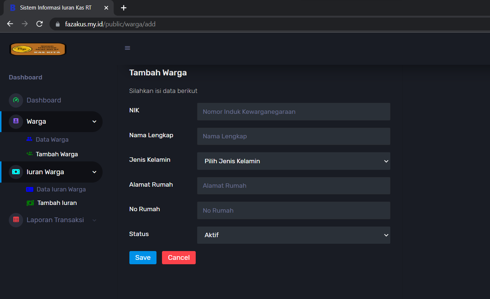
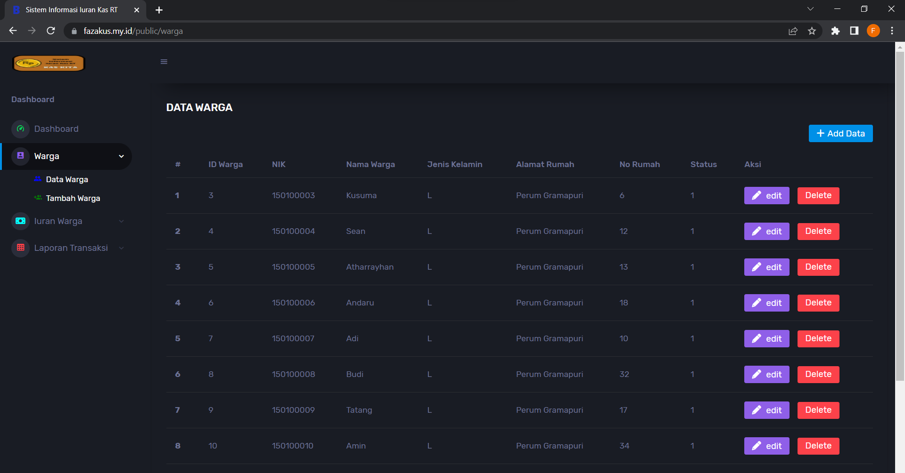
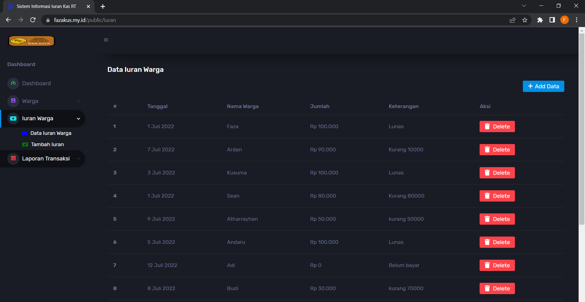
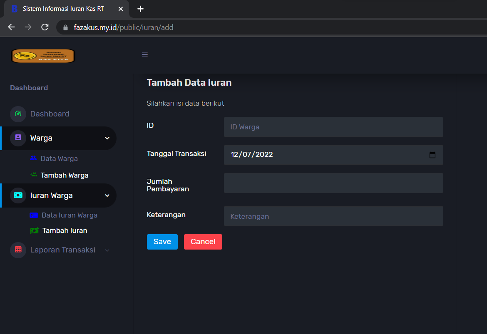
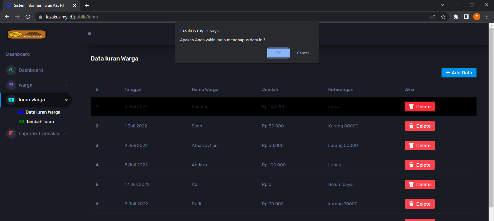

# Sistem Informasi Iuran Kas RT | KAS KITA

|   |   |
|---|---|
| Nama | Faza Ardan Kusuma |
| NIM | 312010001 |
| Kelas | TI 20 B1 |
| Link Website | https://fazakus.my.id/public |

**KAS KITA** adalah sistem informasi iuran kas RT yang dibuat menggunakan Framework PHP : CodeIgniter v.4.2

Website ini dibuat untuk memenuhi Ujian Akhir Semester 4 matakuliah Pemrograman Web yang diampu oleh Bapak Agung Nugroho, S.Kom., M.Kom, Program Studi Teknik Informatika, Universitas Pelita Bangsa Cikarang

## Fitur Website
Website ini mempunyai beberapa fitur, yaitu :
- Data warga (tambah data, edit data, hapus data)
- Data iuran warga (tambah data, edit data, hapus data)
- Laporan yang belum bayar iuran
- Laporan bulanan / tahunan

## Tampilan Website
Dalam tampilan website awal ini atau bisa dibilang Dashboard akan menampilkan berapa jumlah iuran Kas Warga yang sudah terkumpul dan berapa jumlah warganya. 
Berikut adalah tampilan dari website : 
 

## Data Warga
Halaman data warga berfungsi untuk menampilkan data warga
Berikut adalah tampilan dari data warga : 
 

## Tambah Warga
Didalam halaman data wara ada opsi untuk menambahkan data warga dengan klik sub menu pada sidebar Warga, yaitu <i>Tambah Warga</i> atau bisa juga dengan icon di atas kanan <i>+ Add data</i>. Berikut adalah tampilan setelah memasuki menu Tambah Warga : 
 
Dalam menu tambah warga disini, data yang harus ditambahkan adalah :
- NIK (Nomor Induk Kewarganegaraan)
- Nama Lengkap
- Jenis Kelamin
- Alamat rumah
- No rumah
- Status
 

## Hapus Data Warga
Untuk menghapus data warga bisa pada menu <i>Data Warga</i> lalu cari data yang mana yang akan dihapus, kemudian klik icon <i>Delete</i> disamping data tersebut. 
 

## Iuran Warga
Pada Menu ini yang akan ditampilkan adalah data iuran warga. berikut adalah tampilannya : 
 

## Tambah Iuran Warga
Untuk menambah data iuran warga, bisa dengan klik pada sidebar yaitu <i>Tambah Iuran</i>, atau juga bisa dengan klik icon di atas kanan yaitu <i> + Add Data </i>. Berikut adalah tampilannya : 
 
Untuk menambahkan data iuran kita harus mengetahui **ID** warga yang ada pada data warga, kemudian isi tanggal berapa warga tersebut melakukan iuran, jumlah iurannya berapa dan keterangannya apa kemudian save untuk menambahkan.

## Hapus Data Iuran Warga
Bila ada kesalahan data maka kita bisa menghapus data iuran warga dengan mencari mana data yang akan kita hapus kemudian klik icon <i>Delete</i> pada sebelah kanan data tersebut. Berikut tampilannya : 
 

